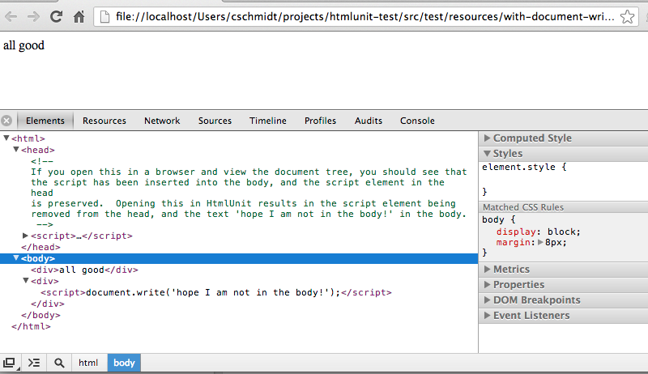

Just shows that HtmlUnit wipes out the existing DOM completely if dynamically 
inserted script contains document.write() statements, unlike real browsers.

[src/test/java/cschmidt/HtmlUnitTest.java](blob/master/src/test/java/cschmidt/HtmlUnitTest.java)
 demonstrates the issue

the sample html file is at 

[src/test/resources/with-document-write-script.html](blob/master/src/test/java/cschmidt/HtmlUnitTest.java)

Here's what the DOM ends up as in Chrome when loading the sample html file:

